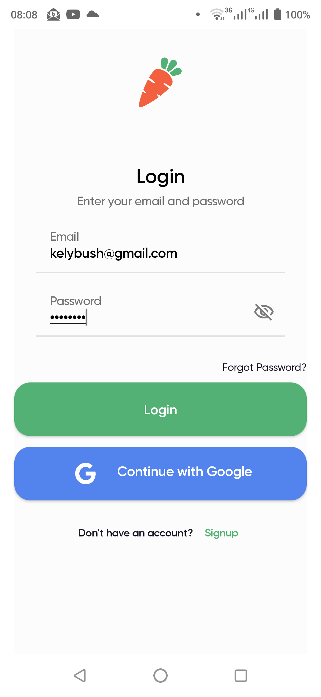
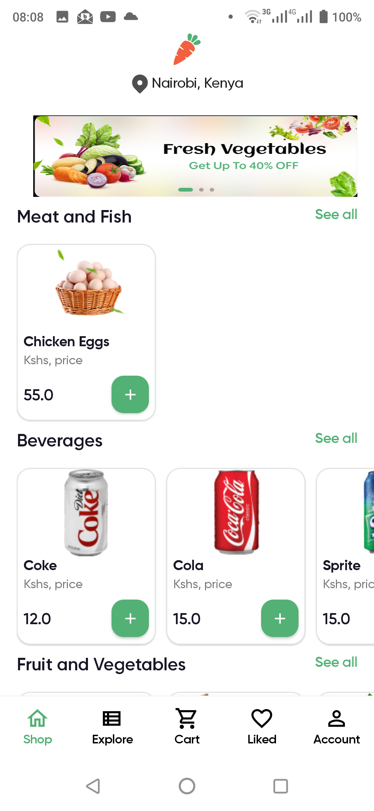
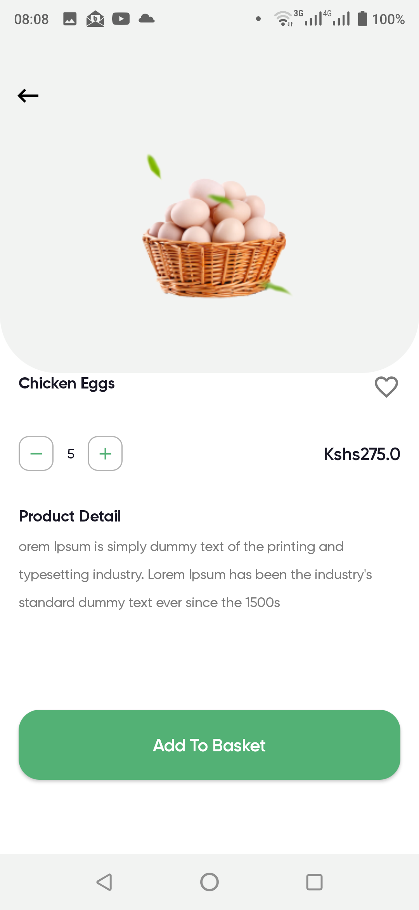
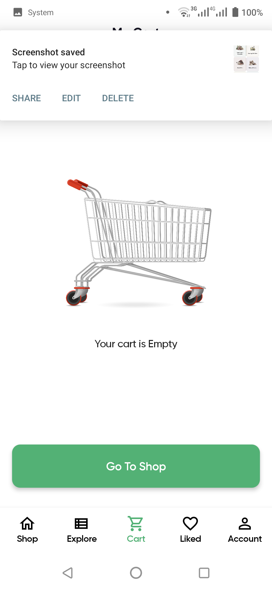
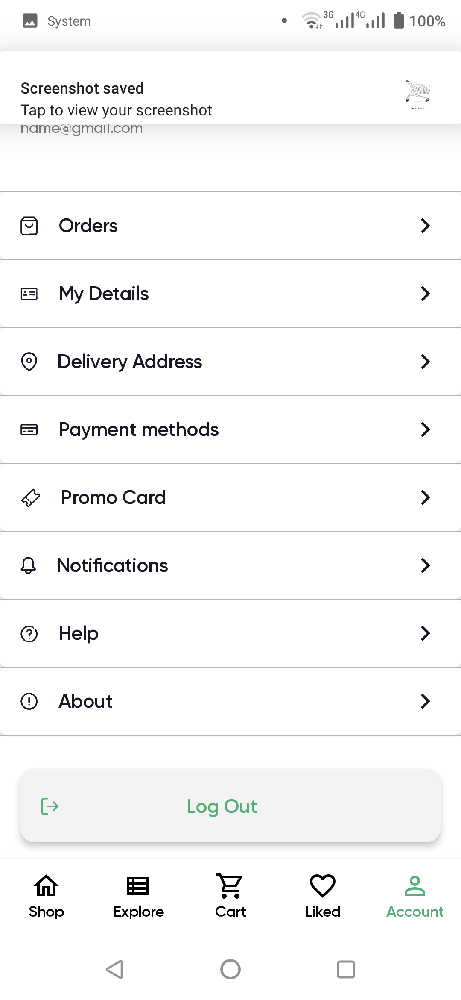

# Nectar
An android ecommerce application for groceries consuming the [Fruity API](https://github.com/kelvinbush/Fruity-S). Using
Jetpack compose, authentication with jwt and clean architecture.


### User stories
* I can sign up and register on the app - authentication by jwt provided by the backend ([Fruity API](https://github.com/kelvinbush/Fruity-S)) or via social login.
* I can explore available products on the shop.
* I can view details of the product.
* I can add a product to cart.
* I can manage products in the cart (Increase or decrease or remove from cart).
* I can manage their account.

### The final app screens:

<div align="center">

 
 

 
 
</div>


* Tech-stack
    * [Kotlin](https://kotlinlang.org/) - a cross-platform, statically typed, general-purpose programming language with type inference.
    * [Coroutines](https://kotlinlang.org/docs/reference/coroutines-overview.html) - perform background operations.
    * [Flow](https://kotlinlang.org/docs/reference/coroutines/flow.html) - handle the stream of data asynchronously that executes sequentially.
    * [Jetpack](https://developer.android.com/jetpack)
        * [Lifecycle](https://developer.android.com/topic/libraries/architecture/lifecycle) - perform action when lifecycle state changes.
        * [ViewModel](https://developer.android.com/topic/libraries/architecture/viewmodel) - store and manage UI-related data in a lifecycle conscious way.
        * [Compose](https://developer.android.com/jetpack/compose?gclsrc=ds&gclsrc=ds) - build clean modern android UIs.
        * [Hilt](https://developer.android.com/training/dependency-injection/hilt-android) - dependency injection library for Android that reduces the boilerplate of doing manual dependency
        * [Navigation component](https://developer.android.com/guide/navigation) - perform complex navigation.

* Architecture
    * MVVM - Model View View Model


### Features under heavy development

- [ ] Adding social login
- [ ] Implementing search via the API
- [ ] Adding Paging 3
- [ ] Adding payment methods
- [ ] Uploading to Google Playstore

### Attributions
UI kit design by [Afsar Hossen](https://dribbble.com/imshuvo97?ref=uistore.design)

## License
```
MIT License 

Copyright (c) 2022 Kelvin Bush

Permission is hereby granted, free of charge, to any person obtaining
a copy of this software and associated documentation files (the
"Software"), to deal in the Software without restriction, including
without limitation the rights to use, copy, modify, merge, publish,
distribute, sublicense, and/or sell copies of the Software, and to
permit persons to whom the Software is furnished to do so, subject to
the following conditions:

The above copyright notice and this permission notice shall be
included in all copies or substantial portions of the Software.

THE SOFTWARE IS PROVIDED "AS IS", WITHOUT WARRANTY OF ANY KIND,
EXPRESS OR IMPLIED, INCLUDING BUT NOT LIMITED TO THE WARRANTIES OF
MERCHANTABILITY, FITNESS FOR A PARTICULAR PURPOSE AND
NONINFRINGEMENT. IN NO EVENT SHALL THE AUTHORS OR COPYRIGHT HOLDERS BE
LIABLE FOR ANY CLAIM, DAMAGES OR OTHER LIABILITY, WHETHER IN AN ACTION
OF CONTRACT, TORT OR OTHERWISE, ARISING FROM, OUT OF OR IN CONNECTION
WITH THE SOFTWARE OR THE USE OR OTHER DEALINGS IN THE SOFTWARE.
```
